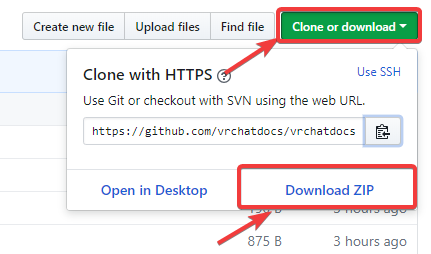

# aytimothy's VRChat Documentation

Welcome to aytimothy's VRChat Documentation! Here, you can find information about how VRChat works, its systems and 
components. Furthermore, in addition to what the [official documentation](https://docs.vrchat.com/docs/) has, you
can find tips and tricks on how to create content for VRChat.

**You can navigate the documentation using the panel on the left side of the page**.

If you have any problems with your account or something out of the community's control, you probably want to check out
VRChat's [Knowledgebase](http://help.vrchat.com/help_center). Use the "Click here for help" button if you need to get
in touch with a human.

You can also find some useful resources in [`resources.md`](resources.md).

## Work In Progress

There's a lot of pages missing, so it would be tremendous help to have whatever is already topic marked in the sidebar to be copied
over from the official documentation if it exists.

## Offline Version

You can download an offline copy that you can run on your computer for reference, or for editing and then for submission to be
integrated back into the official published copy of this documentation.

Simply click on the GitHub button on the top-right hand corner of the page, or go to [https://github.com/vrchatdocs/vrchatdocs](https://github.com/vrchatdocs/vrchatdocs).

Before anything, ensure you have [Node.JS](https://nodejs.org) and [git](http://git-scm.org/) installed. Open a command
prompt (`cmd`) and navigate to wherever you want to save it, and then clone it.

    cd [Path to wherever you want to save it.]
	git clone https://github.com/vrchatdocs/vrchatdocs.git

Finally, run the local server to view the files. They are automatically rebuilt on runtime by 
[Docsify](https://github.com/docsifyjs/docsify/) and hosted locally with the following command:

    docsify serve docs

If you are not planning on contributing, just use the "Download ZIP" button and run the above serve command in
a command prompt with the project folder as context (first two commands).

## Contributing

Please note that this is not official documentation and may not be up-to-date always. However, if something is changed,
feel free to raise [an issue](https://github.com/vrchatdocs/vrchatdocs/issues/new) or create a 
[pull request](https://github.com/vrchatdocs/vrchatdocs/compare). For more information, see [`contributing.md`](contributing.md).

The same goes if you feel this documentation is missing something.