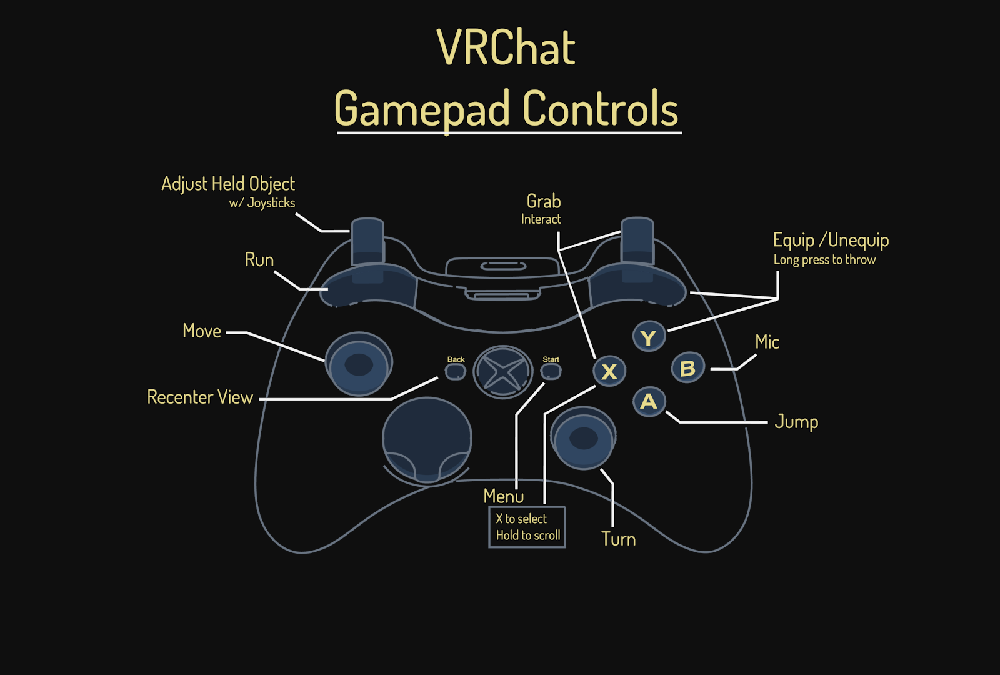

# Avatars

Avatars are the characters that you play as in VRChat. They are your virtual body in VRChat.

## The Avatar Tab

The avatar screen is where you can select the avatars that you already have. Here, you can browse your collection.
When you first open the avatar screen, it will have your currently equipped avatar selected.

|Number|Name|Description|
|------|----|-----------|
|1|Currently Selected Avatar|This section displays the avatar that you have currently selected.|
|2|Avatar Button|Press this button to select the specified avatar.|
|3|Change|Changes your current avatar to the one you have selected.|
|4|Favourite|Adds the currently specified avatar to your favourites for easy access later.|
|5|Avatar Stats|Displays information about the performance and statistics about the specified avatar.|

A yellow star in a box (be it avatar or world) means that you have favourited it. At the current moment, you can favourite
up to 16 avatars. Any additional will have to either be uploaded by you, or you'll have to simply go back to their
respective avatar world to re-equip it.

The avatar screen also has four sections:

* **Favourite Avatars** - Which as it says on the tin, are avatars you've marked as favourite (4).
* **Mine** - These are avatars you have uploaded. You can upload avatars once you have reached the rank of "New User".
* **Public** - These are the standard de-fecto avatars that are provided by VRChat. If you're going to have fun in VRChat,
  you'll want to move away from these avatars as soon as possible.
* **Avatar Worlds** - This is a section which displays avatar worlds. Avatar Worlds are worlds that contains Avatar Pedistals.
  More on that further down.

## Avatar Worlds and Pedastals

Avatar Worlds are worlds that houses links to avatars that you can equip. When you equip an avatar from an avatar from an avatar
world, you have to re-visit the world to re-equip it. Fortunately, you can save avatars by simply favouriting them;
equipping the avatar and then marking it as favourite.

There is a list of featured worlds found in the "Avatar Worlds" section in the Avatars Tab.

An avatar pedestal is an object in a world that you can interact to change your avatar. Simply click on it to change to the
displayed avatar. However, while most pedestals are simply a blank cylinder with a picture above it, some have custom bases
(like the one on the left in Big Al's Avatar Corridors).

Some may have actual models on them instead.

To favourite these avatars for quick access, simply equip them and go to the avatar menu and select the Favourite (4) button.

## Controlling your Avatar

### Desktop

On Desktop, you can make your avatar move around by using the standard movement keys.

|Key|Action|
|---|------|
|W|Move Forward|
|A|Strafe Left|
|S|Move Backward|
|D|Strafe Right|
|Z|Crawl (Toggle)|
|C|Crouch (Toggle)|
|Shift|Sprint|
|Spacebar|Jump (where permitted in the world)|

Because you do not have hand controls (like in VR), there are several keys you can use to control your 
character's hand gestures.

Using the left or right shift (for the left and right hand respectively) followed by F1 to F8 to set a gesture.
By default, they use the following gestures, though the animations can be overridden.

|Key|Action|
|---|------|
|F1|Idle Hand Gesture|
|F2|Fist Hand Gesture|
|F3|Open Hand Gesture|
|F4|Point Hand Gesture|
|F5|Peace Gesture|
|F6|Rock n' Roll Hand Gesture|
|F7|Finger Gun Hand Gesture|
|F8|Thums Up Hand Gesture|

For more information, refer to the [Controls](controls.md) page.

### VR

  
  

## Uploading your own Avatar

See the [Avatar Creation](../avatar/intro.md) page for more information.