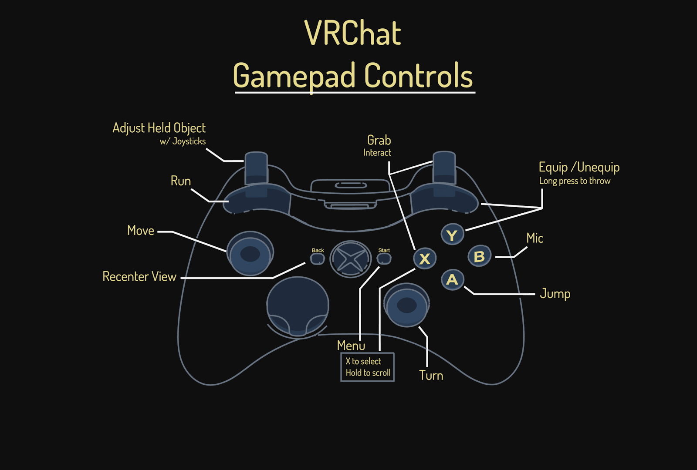
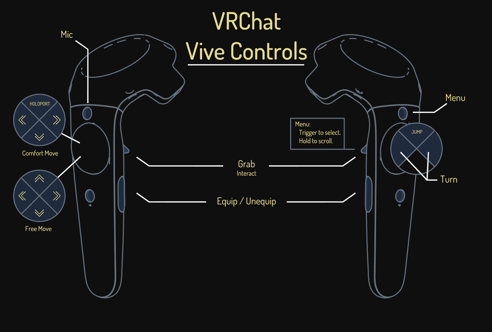
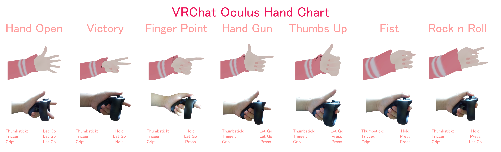

# Controls

This is a reference of all the keys that does things in VRChat. In addition, there are custom keys that are
on a per-world and per-avatar basis that may trigger things in the world, or on your own avatar.

## Keyboard

|Key|What it does|
|---|------------|
|W|Move player forward|
|A|Move player left|
|S|Move player back|
|D|Move player right|
|Space|Makes the player jump (if it is enabled in the room)|
|Z|Crawl; Go Prone (Toggle)|
|C|Crouch (Toggle)|
|Escape|Opens Quick Menu|
|Shift|Makes the player run|
|Left Click|Interact/Pickup|
|Right Click (Hold)|Shows interaction mouse|
|Right Click|Drop current pickup|
|Right Click + F (Hold)|Throws your currently held pickup|
|V|(Toggle and Held) Depending on your settings, it enables the microphone if held or toggles it|
|Control + N|Toggles visibility of player nametags|
|Control + H|Toggles visiblity of the HUD (microphone and notification icons)|
|Control + \|Local switch to default robot (PennyArcade Kyle) avatar|
|Menu + 1|Toggles visibility of trigger debug menu|
|Menu + 2|Toggles visibility of information debug menu|
|Menu + 3|Toggles visibility of console debug menu|
|Menu + 4|Toggles visibility of networking debug menu|
|Menu + 5|Toggles visiblity of networking graph debug menu|
|F12|Takes a screenshot (if not on Steam, it is saved to the folder where VRChat is installed)|
|Shift + F1\*|Hand gesture - Idle|
|Shift + F2\*|Hand gesture - Fist|
|Shift + F3\*|Hand gesture - Open hand|
|Shift + F4\*|Hand gesture - Point|
|Shift + F5\*|Hand gesture - Peace|
|Shift + F6\*|Hand gesture - Rock n' roll|
|Shift + F7\*|Hand gesture - Finger gun|
|Shift + F8\*|Hand gesture - Thumbs up|

\* Use left shift to control your left hand, use right shift to control your right hand

## Controller

  

|Key|What it does|
|---|------------|
|Left Button|Run|
|Right Button|Equip/Unequip (long press to throw)|
|Left Trigger|Adjust Held Object (with Joysticks)|
|Right Trigger|Grab/Interact|
|Left Joystick|Move|
|Back|Recenter View|
|Start|Quick Menu|
|Right Joystick|Rotate Camera|
|Y|Equip/Unequip (long press to throw)|
|X|Grab/Interact|
|B|Microphone Toggle/Trigger (depending on settings)|
|A|Jump|
|D-Pad|(Nothing)|

## VR

  