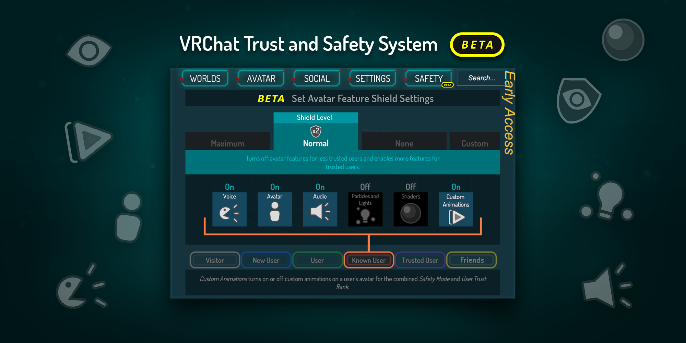
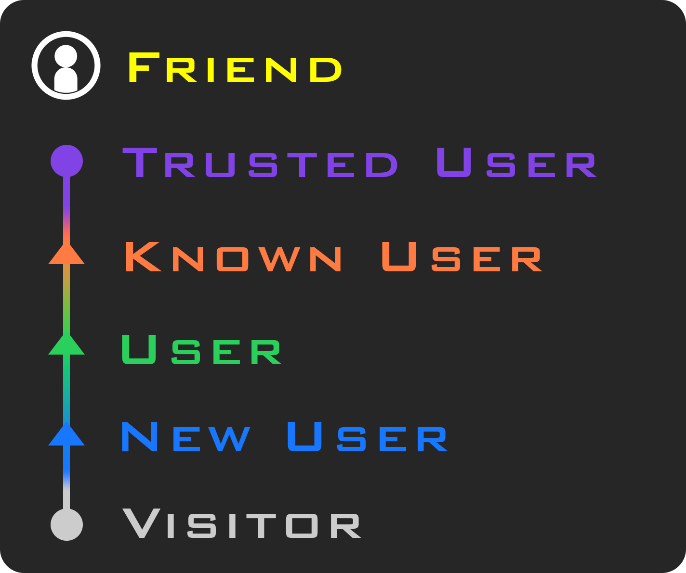
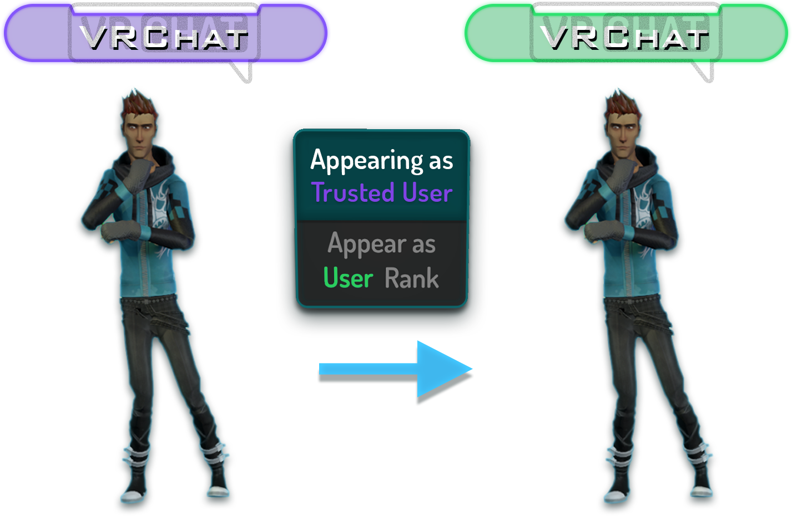

# VRChat Safety and Trust System

(Copied straight from the [documentation](https://docs.vrchat.com/docs/vrchat-safety-and-trust-system))

The VRChat Trust and Safety system is a new extension of the currently-implemented VRChat Trust system. 
It is designed to keep users safe from nuisance users using things like screen-space shaders, loud sounds or microphones,
visually noisy or malicious particle effects, and other methods that someone may use to detract from your experience 
in VRChat.

This system is designed to **give control back to the user**, allowing users to determine where, when, and how they see 
various avatar features that may be distracting or malicious if used improperly.

It is important to note that this system is currently in **BETA**, and may change with any given release or patch.

[VRChat Trust Demo](../images/vrchat-safety-demo.mp4 ':include')

The Trust and Safety system is designed so that, even when left on default settings, 
the system will ensure that someone can't attack you with malicious avatar features. Malicious users won't have 
these features shown, so you can have a good experience in the metaverse.

There are two vital components of this system, the Trust system, and the Safety system. Let's go over them in a 
bit more detail.

## The Trust System

The Trust system is actually already implemented in VRChat! It is what determines when a user is permitted to upload 
content &minus; you may have heard us calling it "Content Gating" previously. However, the system is far more than just 
determining if you can upload content &minus; it looks at user behavior to determine "Trust", which is an aggregate of many 
variables. We can easily adjust the way we calculate this value, so we can tweak it as time goes on.

## Trust Rank

A user's Trust feeds into something we've called a "Trust Rank", which is an indicator of how much time a user has 
spent in VRChat, how much content they've contributed, the friends they've made, and many other factors. These ranks 
are as follows:

You gain these ranks simply by playing VRChat &minus; as you explore worlds, make friends, and create content, you will gain 
more Trust, which determines your Trust Rank. The ranks correspond to the color of your nameplate (see the color of the 
text for an example), and they also play a vital part in the Safety System, which we'll describe later on.

Friends are a special Trust Rank. Users that you have Friended have all of their avatar features shown in the Normal 
Shield Level, and you can customize them just like any other Trust Rank.

The transition between "Visitor" and "New User" is a special one &minus; when a Visitor becomes a New User, they gain the 
ability to upload content to VRChat as long as they're using a VRChat account. Users receive a notification when they 
have passed this rank, and are directed to the VRChat documentation page to get started with creating content.

In a future version, users will receive a notification when they transition Trust Ranks.

All ranks from "Known User" and upward also have the ability to toggle off the display of their rank on their nameplate. 
They can choose to appear as a "User", which will turn their nameplate to the User color, and will also change how 
the Safety system treats them to match the User template. This is for users who do not wish to show off their higher 
rank for whatever reason.

By default, Known and Trusted users will display their rank. Using the toggle will revert you to User.

Additionally, there exists a special rank called “Nuisance”. These users have caused problems for others, and will 
have an indicator above their nameplate when your quick menu is open. Most of the time, these users’ avatars will be 
completely blocked. In a future release, users who are sliding toward the “Nuisance” rank will be notified.

Finally, there exists a “VRChat Team” rank, which is only usable by VRChat Team members. When a VRChat Team member 
has their “DEV” tag on, you’ll see this rank in the quick menu when you select them. If you have doubts that a user 
with a “DEV” tag is actually on the VRChat Team, just open your Quick Menu, select them, and check out their Trust Rank. 
If it doesn’t say “VRChat Team” under the avatar thumbnail, then that user is not a member of the VRChat Team, and is
likely trying to confuse users. Feel free to take a screenshot and report them to the Moderation team!

If a VRChat Team member doesn’t have their “DEV” tag on, they’ll appear as a normal user with their actual Trust Rank.

## What does the Safety System do?

“Safety” is a new menu tab that allows you to configure how users of each rank are treated in regards to how they 
display for you in VRChat. This affects many aspects of a user’s presence in VRChat:

* Voice &minus; Mutes or unmutes a user’s microphone (voice chat)
* Avatar &minus; Hides or shows a user’s avatar as well as all avatar features. When an avatar is hidden, it shows a 
  “muted” avatar
* Avatar Audio &minus; Enables or disables sound effects from a user’s avatar (not their microphone)
* Animations &minus; Enables or disables custom animations on a user’s avatar
* Shaders &minus; When disabled, all shaders on a user’s avatar are reverted to Standard. The behavior behind the Shader 
  blocking system is detailed on our Shader Blocking System doc page
* Particles and Lights &minus; Enables or disables particle systems on a user’s avatar, as well as any light sources. 
  This will also block Line and Trail Renderer components.

Each rank has their own unique settings. To illustrate this, here’s a screenshot of the Safety Menu:

// todo. Copy the rest of the media and stuffs.